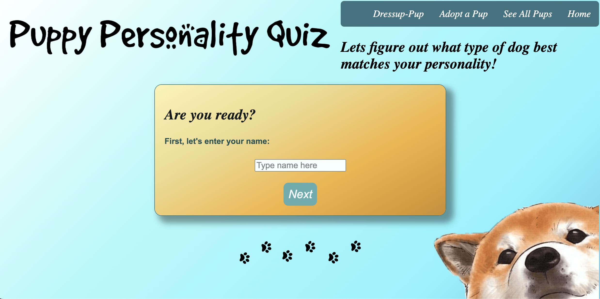
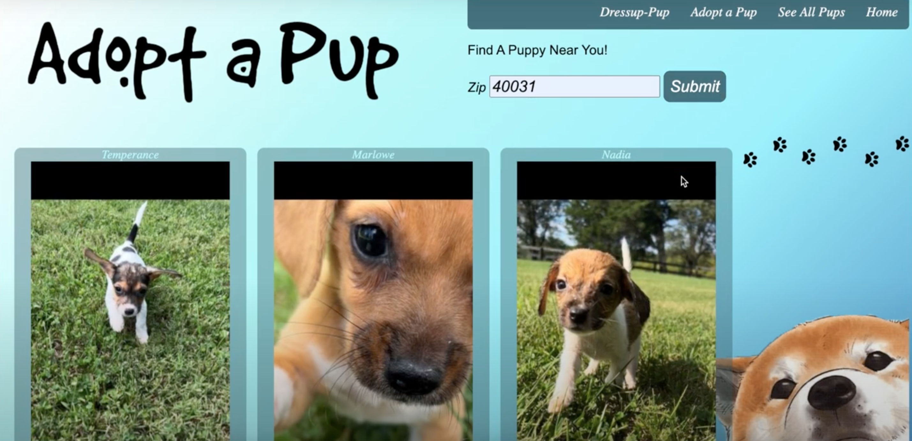
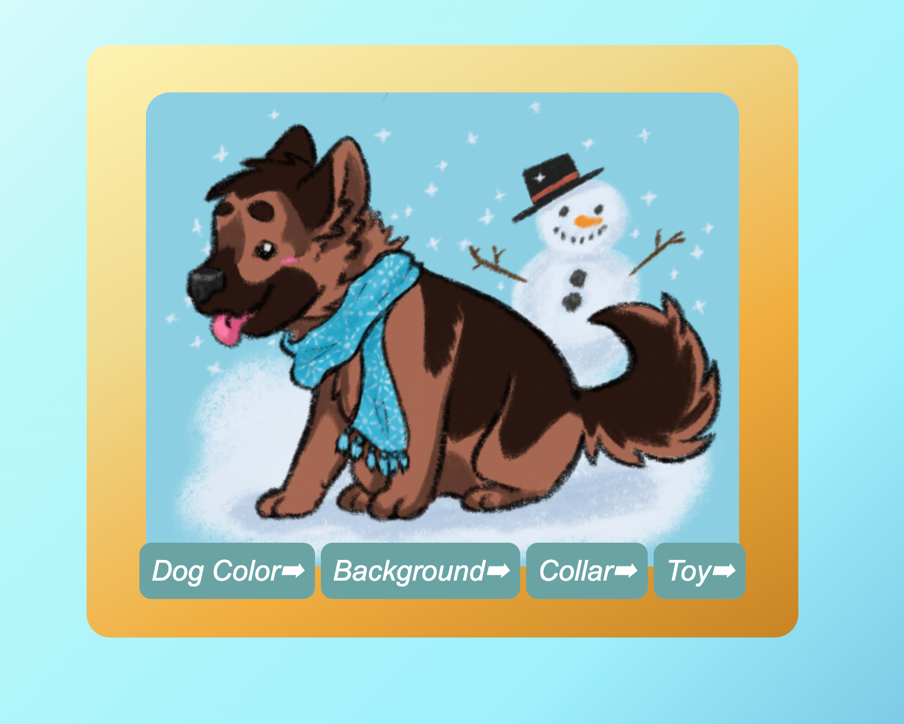

Puppy Themed Activity Site:

Deployed: https://puppy-personality.herokuapp.com/
Youtube video demo: https://www.youtube.com/watch?v=gnZUn0HLmf0

The site allows the user to play two different dog themed web games: a personality quiz and a dog dressup game, while also drawing attention to the plight of homeless dogs near the user. By entering their zip code on the "Adopt a Pup" page, they're able to see up to 20 dogs in their area at local shelters and rescues. With so many dogs unable to find homes, having a fun way to view and interact with the site removes some stigma of

This project shows multiple uses of technologies like Axios, the Petfinder API, JS, HTML, CSS, and use of a local database through the json file.

The home page prompts you to enter a name to begin the personality quiz, which leads you through a series of 8 questions. Each answer has a value added to an array, which is summed together. These totals are linked to the JSON database with different dog descriptions. Clicking submit at the last question will give you your result, but clicking See All Pups will show each possible option from the database.

The next page to visit is the Adopt A Pup page. It has a place to enter your zipcode, and then press submit. This sends a request to the Petfinder API to get dogs available local to that zipcode. This information is returned in an object array. Destructuring the objects allows the dogs to be populated on the page with an inner HTML function, where they appear with their name, age, gender, and a brief description. Clicking their name takes you to their petfinder profile by using their id number in the database.

Finally you can navigate to the Dress Up Game page. Here, you click through the four button options to change the dog color, backgrounds, toys, and outfit accessories. On the back end, the buttons iterate through a score keeping function, and the number corresponds to a class css element to display the new element with each click. Reaching the end resets the counter to zero to loop freely again.

How run locally:
-Download a copy of the files from github :
-In your terminal, install the dependencies with npm i
-Use Nodemon to run the server, and to update the API Bearer Key, replace the code in line 62 of the petfinder.js, with the code given after running this code in your terminal:
    curl -d "grant_type=client_credentials&client_id=idge7Hh8Sk7LU1Ym0paSgU3QgaIapej5O34NR8ZBQSSu3BLkqV&client_secret=N2Epm32XlytKdIwPx6Xwo64I0RLgD56x7ShGt6x0" https://api.petfinder.com/v2/oauth2/token

This project was coded and drawn by Ciaran Robinson

